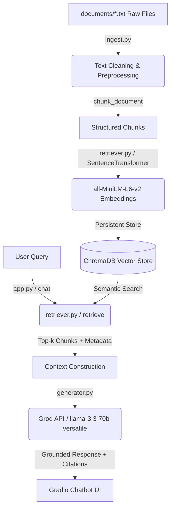

# Project 1 Planning: The Unofficial Guide

Document to plan and record design decisions for the RAG-based Hunter College Computer Science Professor assistant.

---

## Domain

The domain is **Computer Science undergraduate professors and course reviews at Hunter College (CUNY)**. 

Official college resources (like the department faculty directory) only provide email addresses, office locations, and research publications. They offer zero insight into what classes are actually like. Real student survival knowledge—such as course workload (e.g., 20+ hours a week for Operating Systems), whether coding projects are auto-graded with strict style checkers, whether exams are curved, and whether quizzes are pop quizzes—is only found in informal student networks (like Reddit or Rate My Professors). 

This system aggregates this unofficial student knowledge to help students make informed scheduling decisions.

---

## Documents

We collected actual student reviews for 10 undergraduate CS instructors at Hunter College, saved as `.txt` files in `./documents/`:

| # | Source | Description | URL or location |
|---|--------|-------------|-----------------|
| 1 | [Eric Schweitzer](file:///home/lezu/Projects/codepath/ai201/ai201-project1-unofficial-guide-starter/documents/eric_schweitzer.txt) | Undergraduate Advisor/Coordinator. Teaches CSCI 150 (Discrete Math) and CSCI 260 (Architecture). | https://www.ratemyprofessors.com/professor/257192 |
| 2 | [Tiziana Ligorio](file:///home/lezu/Projects/codepath/ai201/ai201-project1-unofficial-guide-starter/documents/tiziana_ligorio.txt) | Doctoral Lecturer. Teaches CSCI 127 (Intro) and CSCI 235 (Software Design I). | https://www.ratemyprofessors.com/professor/815879 |
| 3 | [Melissa Lynch](file:///home/lezu/Projects/codepath/ai201/ai201-project1-unofficial-guide-starter/documents/melissa_lynch.txt) | Lecturer. Teaches CSCI 127 (Intro) and CSCI 160 (Computer Architecture/C++). | https://www.ratemyprofessors.com/professor/2505090 |
| 4 | [Saad Mneimneh](file:///home/lezu/Projects/codepath/ai201/ai201-project1-unofficial-guide-starter/documents/saad_mneimneh.txt) | Associate Professor. Teaches CSCI 150 (Discrete Math) and CSCI 250 (Algorithms). | https://www.ratemyprofessors.com/professor/926045 |
| 5 | [Susan Epstein](file:///home/lezu/Projects/codepath/ai201/ai201-project1-unofficial-guide-starter/documents/susan_epstein.txt) | Professor. Teaches CSCI 150 (Discrete Math) and CSCI 340 (Intro to AI). | https://www.ratemyprofessors.com/professor/192300 |
| 6 | [Pavel Shostak](file:///home/lezu/Projects/codepath/ai201/ai201-project1-unofficial-guide-starter/documents/pavel_shostak.txt) | Doctoral Lecturer. Teaches CSCI 150 (Discrete Math), CSCI 260 (Architecture), CSCI 360 (Software Eng). | https://www.ratemyprofessors.com/professor/1823870 |
| 7 | [Mike Zamansky](file:///home/lezu/Projects/codepath/ai201/ai201-project1-unofficial-guide-starter/documents/mike_zamansky.txt) | Distinguished Lecturer. Teaches CSCI 127 (Intro), CSCI 135 (Software Design II), and leads the Daedalus program. | https://www.ratemyprofessors.com/professor/2212256 |
| 8 | [Katherine St. John](file:///home/lezu/Projects/codepath/ai201/ai201-project1-unofficial-guide-starter/documents/katherine_st_john.txt) | Professor. Teaches CSCI 127 (Intro) and CSCI 39579 (Computational Biology). | https://www.ratemyprofessors.com/professor/2324096 |
| 9 | [Stewart Weiss](file:///home/lezu/Projects/codepath/ai201/ai201-project1-unofficial-guide-starter/documents/stewart_weiss.txt) | Associate Professor. Teaches CSCI 235 (Software Design I) and CSCI 340 (Operating Systems). | https://www.ratemyprofessors.com/professor/192304 |
| 10 | [Ioannis Stamos](file:///home/lezu/Projects/codepath/ai201/ai201-project1-unofficial-guide-starter/documents/ioannis_stamos.txt) | Professor. Teaches CSCI 135 (Software Design II) and CSCI 415 (Computer Vision). | https://www.ratemyprofessors.com/professor/64427 |

---

## Chunking Strategy

**Chunk size:** Review-based dynamic splitting (approx. 100-250 characters per review block)  
**Overlap:** None  

**Reasoning:**
Rather than splitting text at arbitrary character boundaries (which often cuts comments in half and divorces the review text from the professor's name), we split the files using the `---` separator. The first chunk represents the overall profile statistics header. Each subsequent chunk represents a complete, self-contained student review. We programmatically prepend `"Professor: [Name]\n"` to each chunk to ensure the identity context is mathematically bound to every vector representation. This fits the review-heavy corpus perfectly since student comments represent distinct, independent opinions.

---

## Retrieval Approach

**Embedding model:** `all-MiniLM-L6-v2` via `sentence-transformers`  
**Top-k:** 4  

**Production tradeoff reflection:**
If deploying this system to a production environment with thousands of users and documents, we would consider the following tradeoffs:
1. **Cost:** `all-MiniLM-L6-v2` runs locally and is 100% free with zero API call costs. However, it consumes server memory and CPU/GPU. In contrast, cloud APIs (like OpenAI's `text-embedding-3-small`) cost money per token but shift the computational scaling burden off our servers.
2. **Context Length:** `all-MiniLM-L6-v2` has a sequence limit of 256 tokens. While perfect for short student reviews, it would fail to embed entire course syllabi or long academic guides. A production deployment would benefit from models with larger context lengths (e.g., `text-embedding-3-small` with 8191 tokens).
3. **Multilingual Support:** The local model has poor multilingual alignment. If students write reviews in multiple languages (e.g., Japanese, Chinese, English), a multilingual model like `multilingual-e5-base` would be required to perform semantic search across languages.
4. **Latency vs. Throughput:** Local inference has zero network latency, making it extremely fast. However, scaling to handle thousands of concurrent search requests requires deploying and managing a cluster of inference containers, whereas cloud APIs scale automatically.

---

## Evaluation Plan

We will evaluate the system's accuracy and grounding using these 5 "few shot" test questions:

| # | Question | Expected answer |
|---|----------|-----------------|
| 1 | Why do students recommend to "take the test out" for Katherine St. John's CSCI 127 class? | Because they feel her class is outdated, lectures are a mess, she cannot communicate properly, and she flags/reports majority of the class for cheating or AI use. |
| 2 | What are the rules regarding the final exam in Katherine St. John's courses? | In her elective course CS39542, if you fail the final exam, you fail the course. |
| 3 | How does Saad Mneimneh curve grades in his classes? | For STAT 319, grades are curved using the square root ($\sqrt{x}$) method. For CSCI 705, he applies a generous curve and allows students below a B to do extra work for a B+. For CSCI 150, he offers curves and extra credit in recitation. |
| 4 | Why was a student flagged for cheating by Katherine St. John on a homework they missed? | The student missed the homework because they were trying to beat the "Demon of Hatred" in the game Sekiro all day, and St. John flagged them for cheating anyway. |
| 5 | What kind of questions make up a large portion of Stewart Weiss's exams and quizzes? | Tricky true or false questions make up 30% of exams and 90% of quizzes in CSCI 340. |
| 6 | Which professors teach CSCI 150 according to the reviews? | Based on the loaded reviews, CSCI 150 has been taught by Ioannis Stamos, Saad Mneimneh, Eric Schweitzer, and Susan Epstein. |
| 7 | Which professor has the lowest "Would take again" score? | Susan Epstein has the lowest "Would Take Again" score at 15.1%. |

---

## Anticipated Challenges

1. **Information Bottleneck:** Some queries may refer to details not captured in the RMP reviews, in which case the model must cleanly refuse to answer rather than guess.
2. **Entity Variants:** The model must understand that "CSCI 127", "12700", and "CS127" refer to the same course.
3. **Imprecise Splits:** If a review contains a `---` characters inside its comment text, it could split the chunk incorrectly. We strip and check chunk size to filter empty blocks.

---

## Architecture

---

## AI Tool Plan

**Milestone 3 — Ingestion and chunking:**
We will prompt Claude Gemini to write a review-based split function in `ingest.py`. We'll give it the format of our RMP `.txt` documents and ask it to split on `---`, parse headers, and programmatically prepend `"Professor: [Name]"` to each chunk. We will verify by printing the generated chunk count (60 chunks) and confirming text completeness.

**Milestone 4 — Embedding and retrieval:**
We will use AI to write the collection setup and search logic in `retriever.py`. We will check that similarity scores on matched results are within normal ranges (below 0.5 for good matches) and verify metadata mapping.

**Milestone 5 — Generation and interface:**
We will prompt AI to write the LLM call using the Groq python SDK with temperature `0.0`. We will instruct it to use a system prompt that enforces strict grounding and a python script that appends clickable file links for citations.
